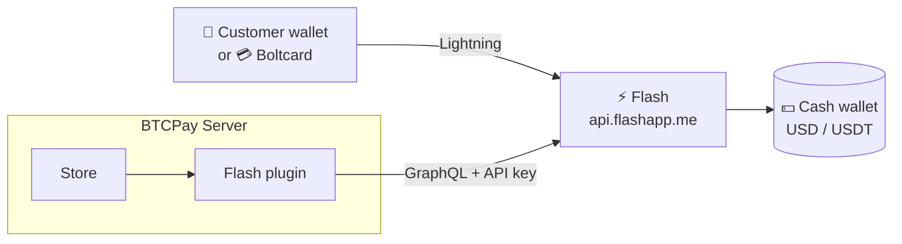

# Flash for BTCPay Server

**Use a Flash account as your store's Lightning node.**
No node to run, no channels to manage. Payments settle in the account's dollar wallet.

> [!NOTE]
> This plugin powers **Flashcard v1** (Boltcard NFC cards on BTCPay Server).
> **Flashcard v2** runs on a Cashu stack that works offline, with no BTCPay Server:
> [cashu-javacard](https://github.com/lnflash/cashu-javacard) · [cashu-client](https://github.com/lnflash/cashu-client) · [flash](https://github.com/lnflash/flash)

## How it fits

## Quick start

| | Step |
|---|---|
| 1 | Create an API key at **[console.flashapp.me](https://console.flashapp.me)** with scopes `read_user` `read_wallet` `write_wallet` `read_transactions` |
| 2 | Download `BTCPayServer.Plugins.Flash.btcpay` from **[Releases](https://github.com/lnflash/btcpayserver-flash-plugin/releases/latest)** and upload it in *Server Settings → Plugins*, then restart |
| 3 | In *Store → Lightning → Use custom node*, enter: `type=flash;server=https://api.flashapp.me/graphql;token=fk_...` |

Full walkthrough: **[docs/installation.md](docs/installation.md)**

## What it does

| | |
|---|---|
| ⚡ **Receive** | Lightning invoices from the account's dollar wallet, priced in cents |
| 📤 **Send** | Payouts and refunds paid from the same wallet |
| 💳 **Boltcards** | Card top-ups and tap-to-pay through BTCPay's Boltcards plugin |
| 🔗 **LNURL** | LNURL-pay, LNURL-withdraw and Lightning Address |
| ✅ **Exact confirmation** | An invoice is marked paid only when Flash confirms *that* invoice. Nothing is inferred from transaction history |

## Documentation

| Guide | |
|---|---|
| [Installation](docs/installation.md) | API key, install, connection string, updating |
| [How it works](docs/how-it-works.md) | Payment flows, how payments are confirmed, limitations |
| [Troubleshooting](docs/troubleshooting.md) | Common errors and what they mean |
| [Development](docs/development.md) | Repository layout, building, releasing |
| [Changelog](CHANGELOG.md) | Release history |

## License

MIT
