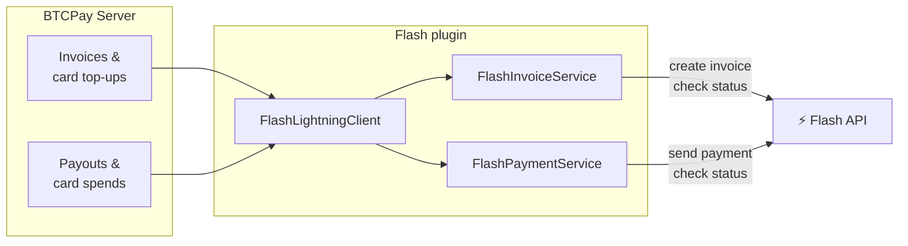
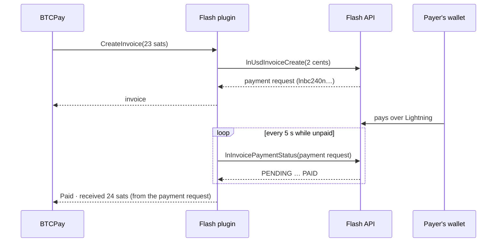
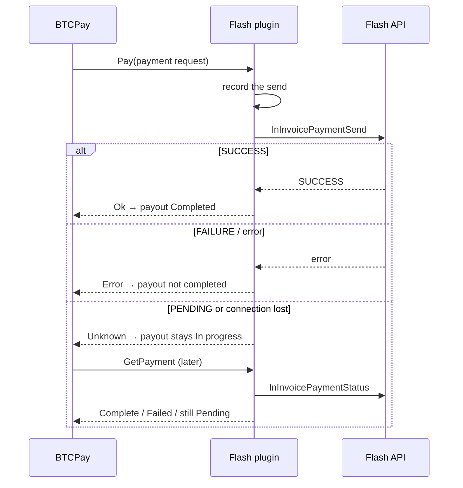

# How it works

The plugin implements BTCPay Server's `ILightningClient` on top of the Flash GraphQL API. BTCPay asks it to create invoices, report whether they are paid, send payments, and report on those payments. The plugin answers each question with a call to Flash.

## Receiving

- **Amounts.** The cash wallet is denominated in US cents. BTCPay's amount in sats is converted at Flash's live rate and **rounded up** to whole cents, so an invoice is never worth less than BTCPay asked for.
- **Confirmation.** Flash's transactions carry no payment hash, so a transaction cannot be matched to an invoice. The plugin asks Flash about each invoice's own payment request instead, and reports *paid* only when Flash says `PAID`.
- **Amount received** comes from the payment request itself, not from a transaction.

## Sending

`GetPayment` answers only from the record of sends this plugin made, never from guesses. A payment it has no record of is reported as pending.

## The cash wallet

Flash accounts hold dollars in a **cash wallet**, which Flash is moving from USD to USDT. The plugin declares `X-Flash-Client-Capabilities: cash-wallet-usdt-v1` on every request, as the Flash mobile app does, and uses the USDT wallet when the account has one. Without that header the API shows the old USD wallet, and payments sent from it fail with an empty balance.

## Authentication

| Token | Sent as | Payment updates |
|---|---|---|
| API key `fk_...` | `X-API-KEY` header | Polling every 5 s |
| Session token `ory_st_...` | `Authorization: Bearer` | WebSocket, with polling as fallback |

Flash's WebSocket subscriptions accept session tokens only, so with an API key the plugin polls.

## Limitations

| Limitation | Effect | What to do |
|---|---|---|
| Invoices are tracked in memory | An invoice paid across a BTCPay restart is not detected | Avoid restarts during payments; reconcile by hand if one happens |
| Flash cannot report on other nodes' invoices | A send to a non-Flash invoice that Flash answers `PENDING` stays *In progress* | Check the payment in Flash and settle the payout by hand |
| Amounts round up to whole cents | Very small invoices can cost the payer up to 1 cent extra | None needed |
| LNURL wallets that strictly compare amounts | The payment request's amount (whole cents) may differ slightly from the msat amount requested | Most wallets accept it |
