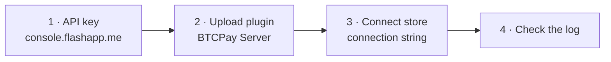

# Installation



## 1. Create an API key

Sign in at [console.flashapp.me](https://console.flashapp.me) and create a key with these scopes:

| Scope | Why the plugin needs it |
|---|---|
| `read_user` | Find the account and its wallets |
| `read_wallet` | Read the cash wallet and its balance |
| `write_wallet` | Create invoices and send payments |
| `read_transactions` | Read transaction history for Boltcard tracking |

The key looks like `fk_<keyId>_<secret>` and is shown **once**. Store it somewhere safe.

> [!TIP]
> Older Flash session tokens (`ory_st_...`) are still accepted, but they expire. Use an API key.

## 2. Install the plugin

1. Download `BTCPayServer.Plugins.Flash.btcpay` from the [latest release](https://github.com/lnflash/btcpayserver-flash-plugin/releases/latest).
2. In BTCPay Server go to **Server Settings → Plugins → Upload plugin**, choose the file, and restart when asked.

> [!IMPORTANT]
> Keep the file name exactly `BTCPayServer.Plugins.Flash.btcpay`. BTCPay unpacks a plugin into a folder named after the file, so a renamed file installs *next to* the old version instead of replacing it, and the old one keeps running.

Requires BTCPay Server 2.x. Tested on 2.4.5.

## 3. Connect a store

In **Store → Settings → Lightning → Use custom node**, paste a connection string:

| Environment | Connection string |
|---|---|
| Production | `type=flash;server=https://api.flashapp.me/graphql;token=fk_...` |
| Test | `type=flash;server=https://api.test.flashapp.me/graphql;token=fk_...` |

All three keys are required: `type=flash`, `server` (the GraphQL endpoint) and `token` (your API key).

## 4. Check it works

Restart or save the store, then look at the BTCPay log. On a Docker install:

```sh
docker logs generated_btcpayserver_1 2>&1 | grep -E "Plugins.Flash - |Found Flash wallet|Flash API key in use"
```

You should see:

```text
Running plugin BTCPayServer.Plugins.Flash - 1.6.6
Flash API key in use - WebSocket subscriptions need a session token, using polling for invoice updates
Found Flash wallet: ID=..., Currency=USD (Flash reports USDT)
```

If you see `401 Unauthorized` or no wallet, see [Troubleshooting](troubleshooting.md).

## Boltcards

Card top-ups and payments go through BTCPay's **Boltcards** plugin. Install it alongside this one and create a Boltcard factory on the same store. The Flash plugin only provides the Lightning connection; updating it does not affect existing cards or factories.

## Updating

Upload the new `BTCPayServer.Plugins.Flash.btcpay` the same way and restart.

> [!WARNING]
> Avoid restarting while a customer is paying. Invoices waiting for payment are tracked in memory, and one that is paid across a restart is not detected automatically. See [How it works → Limitations](how-it-works.md#limitations).
